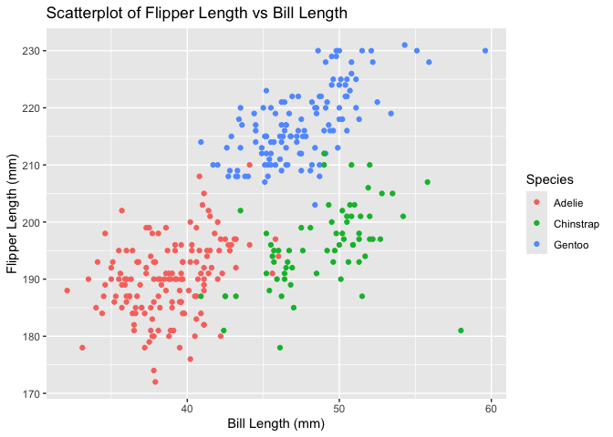

p8105_hw1_jc6422
================
Jianing Chen
2024-09-18

## Problem 1

## load the libraries

``` r
library(palmerpenguins)
library(ggplot2)
library(tidyverse)
```

    ## ── Attaching core tidyverse packages ──────────────────────── tidyverse 2.0.0 ──
    ## ✔ dplyr     1.1.4     ✔ readr     2.1.5
    ## ✔ forcats   1.0.0     ✔ stringr   1.5.1
    ## ✔ lubridate 1.9.3     ✔ tibble    3.2.1
    ## ✔ purrr     1.0.2     ✔ tidyr     1.3.1
    ## ── Conflicts ────────────────────────────────────────── tidyverse_conflicts() ──
    ## ✖ dplyr::filter() masks stats::filter()
    ## ✖ dplyr::lag()    masks stats::lag()
    ## ℹ Use the conflicted package (<http://conflicted.r-lib.org/>) to force all conflicts to become errors

## load the dataset

``` r
data("penguins", package = "palmerpenguins")
```

## Description of the dataset

``` r
n_rows = nrow(penguins)
n_cols = ncol(penguins)
mean_flipper_length = mean(penguins$flipper_length_mm, na.rm = TRUE)
cat("The penguins dataset has", n_rows, "rows and", n_cols, "columns.\n")
```

    ## The penguins dataset has 344 rows and 8 columns.

``` r
cat("The mean flipper length (in mm) is", round(mean_flipper_length, 2), ".\n")
```

    ## The mean flipper length (in mm) is 200.92 .

## View the first few rows of the dataset.

``` r
head(penguins)
```

    ## # A tibble: 6 × 8
    ##   species island    bill_length_mm bill_depth_mm flipper_length_mm body_mass_g
    ##   <fct>   <fct>              <dbl>         <dbl>             <int>       <int>
    ## 1 Adelie  Torgersen           39.1          18.7               181        3750
    ## 2 Adelie  Torgersen           39.5          17.4               186        3800
    ## 3 Adelie  Torgersen           40.3          18                 195        3250
    ## 4 Adelie  Torgersen           NA            NA                  NA          NA
    ## 5 Adelie  Torgersen           36.7          19.3               193        3450
    ## 6 Adelie  Torgersen           39.3          20.6               190        3650
    ## # ℹ 2 more variables: sex <fct>, year <int>

## Create scatterplot

``` r
scatter_plot <- ggplot(penguins, aes(x = bill_length_mm, y = flipper_length_mm, color = species)) + geom_point() +
  labs(title = "Scatterplot of Flipper Length vs Bill Length",
       x = "Bill Length (mm)",
       y = "Flipper Length (mm)",
       color = "Species")
print(scatter_plot)
```

    ## Warning: Removed 2 rows containing missing values or values outside the scale range
    ## (`geom_point()`).

<!-- -->

## Save the scatterplot to a file.

``` r
ggsave("scatterplot_penguins.png", plot = scatter_plot)
```

    ## Saving 7 x 5 in image

    ## Warning: Removed 2 rows containing missing values or values outside the scale range
    ## (`geom_point()`).

## Problem 2

## Create data frame with different variables.

``` r
# Create a random sample of size 10 from a standard normal distribution
numeric_var = rnorm(10)

# Logical vector indicating whether elements of the sample are greater than 0
logical_var = numeric_var > 0

# Character vector of length 10
character_var <- letters[1:10]  # Use the first 10 letters of the alphabet

# Factor vector of length 10, with 3 different factor levels
factor_var <- factor(rep(c("Level1", "Level2", "Level3"), length.out = 10))

# Create a data frame with the variables
df2 <- data.frame(numeric_var, logical_var, character_var, factor_var)

# View the data frame
print(df2)
```

    ##    numeric_var logical_var character_var factor_var
    ## 1   0.11446199        TRUE             a     Level1
    ## 2  -0.44360374       FALSE             b     Level2
    ## 3  -0.68924243       FALSE             c     Level3
    ## 4  -1.36888171       FALSE             d     Level1
    ## 5  -0.12112717       FALSE             e     Level2
    ## 6   0.84327225        TRUE             f     Level3
    ## 7   0.77210257        TRUE             g     Level1
    ## 8   1.52719047        TRUE             h     Level2
    ## 9   0.09428769        TRUE             i     Level3
    ## 10  1.83652267        TRUE             j     Level1
